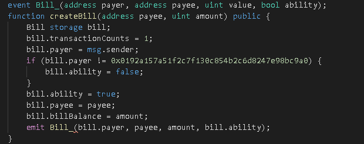
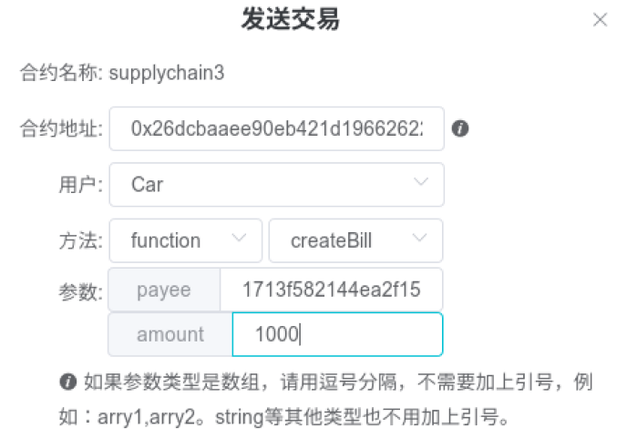
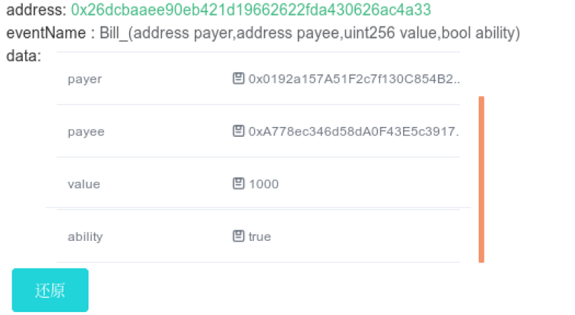
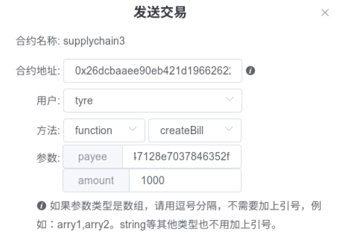
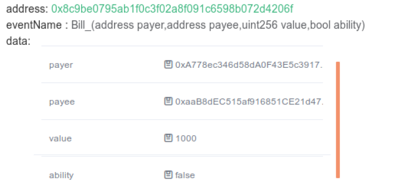

### 说明：由于这次时间紧迫，所以很多功能还没能成功通过测试，不过构思都基本完成了。详细的会在github中（[链接](https://github.com/luji17343080/Lucky-SupplyChain))尽快完成
## 项目设计说明
整个项目的目的是将核心公司（车企）的`还款能力`传递下去，使有核心公司的欠款单据的链上的公司可以通过单据向金融机构（银行）借款融资。然而金融机构只认可车企的还款能力，所以当某企业凭单据向金融机构借款时，金融机构需要对该单据的公司进行评估看是否具有还款能力，在本次的情境下，只需要知道单据的源头是否为车企就行了。显然这就是一个简单的溯源问题，只需要追溯单据最初的付款方是否为车企，所以只需要通过区块链的方式将每次交易的信息记录下来就行了。因此，我认为这次需要设计的供应链金融的平台的核心就是`账款单据`，我通过一个`ability`属性来最终表示一个公司是否具有向金融机构借款融资的能力，当然，`ability`在链上是可以传递的。  
### 下面是一些数据结构介绍：
`公司`Company结构体属性：`公司地址`，`资产`，`单据`  
`单据`Bill结构体属性：`单据金额`，`单据交易双方的地址`，`单据交易时间`，`单据的还款时间`（精确到`日`），该单据是否被银行认可（`ability`为`True`和`False`），单据的交易次数（`transactionCounts`）  
`商品`Commdity结构体属性：商品的生产时间，生产公司...  
## 功能测试（基于Webase平台）  
### 0. 一些基本函数  
- 单据信息初始化：function initBill() public returns(Bill) {}(不过好像不能返回结构体，所以没能成功实现)  
- 公司信息初始化及将地址与Commpany进行映射
- 公司的资金的变化（简单实现）：function changeProperty(Commpany comm, uint amount) public {}
    - 当公司名不为`Bank`时，资金加`amount`
    - 否则，资金减`amount`
- 映射表的建立
### 1. 交易单据生成并上链    
单据生成函数：function createBill(address payee, uint amount) public {}  
  

功能：
- 设置交易双方和单据金额（根据传入参数）
- 交易次数（`transactionCounts`）变为1
- 设置交易时间
- 根据payer（付款公司）确认该单据是否有`ability`
- 根据payee（收款公司）确认该单据交易的商品（`commodity`）信息
- 将Bill加入Commpany与Bill的映射表中

测试：  
用户为单据`Bill`中的付款人，调用`creatBill`方法，参数中的`payee`为收款人的地址，`amount`为Bill的金额：  
- 测试一：  
  
结果如下：可见由车企创建的单据`Bill`的`ability`为true  
  

- 测试二：  
  
结果如下：可见不是由车企创建的单据`Bill`的`ability`为false  
  
### 2. 单据的转让  
简单实现：只能根源为车企的单据才能转让  
要求：
- 单据的`ability`为`true`
- 单据中的交易次数至少为1
- 单据的金额不小于交易金额  
  
函数：function transferBill(address payee, uint amount) public{}  
功能： 
- 创建新的Bill
- 更新交易双方信息
- 付款方单据金额减少
- 收款方单据金额增加
- 交易时间的修改
- 交易次数加1
- 根据收款方获取交易商品的信息  
- 将更新的Bill加入到Commpany的Bill中  
`说明：单据的转让过程中，其实交易双方的信息修改和交易商品的更新是不重要的，重要的是ability的传递、单据金额的变化和交易时间的更新，ability和金额确定公司能否根据此单据向银行借一定资金`
### 3. 凭单据向银行借款融资  
要求：
- Bill的`ability`为`true`
- Bill的金额不小于借款金额
- Bill的收款方必须为银行  
  
函数：function borrowBill(address payee, uint amount) public{}  
功能：  
- 单据转让功能
- 公司资金增加
- 金融机构资金减少
- 将更新的Bill加入到Commpany的Bill中

### 4. 单据的支付结算  
因为这次实现的平台的结算是比较单一的，即是核心企业向下游企业和银行支付单据上的金额，所以只需要检验以下内容  
- `Bill`的`ability`是否为`True`  
- `Bill`的收款时间是否为当前时间之前  
  
函数：function payBill() public {}
功能：
- 查找所有公司的单据
- 单据销毁
- 持有单据的公司资金增加  
- 核心公司的资金减少

